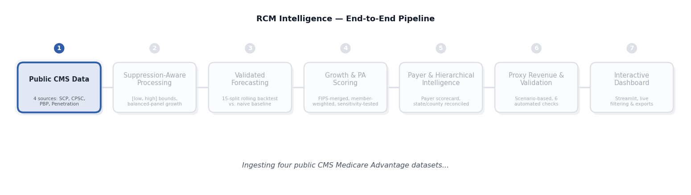
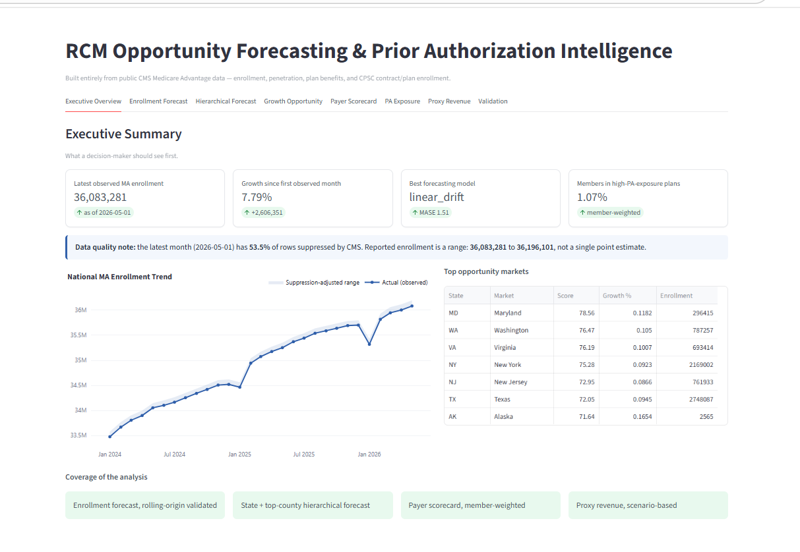
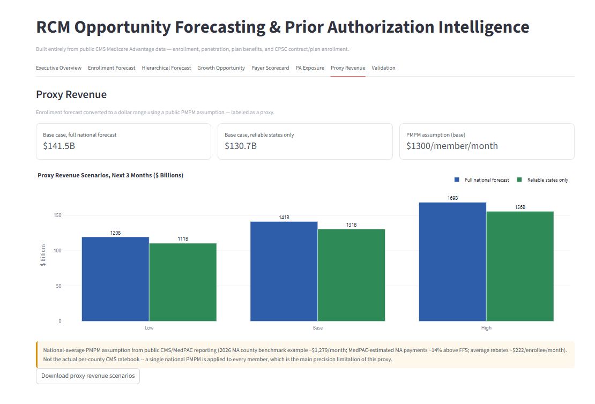

# RCM Opportunity Forecasting & Prior Authorization Intelligence

## Aim

To turn public Medicare Advantage enrollment data into clear, actionable business intelligence for
Revenue Cycle Management (RCM) teams -- showing where enrollment is growing, which insurance payers to
prioritize, where prior-authorization workload is concentrated, and what that growth is worth in dollars.

---

## Overview

This platform analyzes publicly available Medicare Advantage enrollment data covering over 36 million
members across all 50 states and thousands of counties. It answers four practical business questions:

1. **Where is enrollment growing fastest, and where is the untapped opportunity?**
2. **Which insurance payers are growing quickly and worth prioritizing for outreach?**
3. **Where is prior-authorization workload concentrated, so teams can plan capacity?**
4. **What is that enrollment growth worth in revenue terms?**

Every number shown is backed by a validation check, and every limitation of the underlying public data is
stated openly rather than hidden behind a confident-looking chart.

---

## Problem Statement

RCM and business development teams need to know where to focus their limited time and resources: which
states and counties are growing, which insurance payers are the best partners to pursue, and where
administrative workload (like prior authorization) is likely to be heaviest. Public government data holds
the answers, but it is large, partly hidden (some rows are suppressed for privacy), and easy to
misinterpret if not handled carefully. Teams need this turned into a single, trustworthy, easy-to-read
platform -- not a spreadsheet full of gaps and guesswork.

---

## Key Features & Benefits

- **Honest enrollment reporting** -- every figure is shown as a range, reflecting real data limitations
  instead of hiding them.
- **Proven forecasting** -- the enrollment forecast is validated across 15 independent tests, not a single
  lucky guess, and clearly beats a simple baseline.
- **State and county-level market opportunity ranking** -- shows exactly where growth potential is
  highest, stress-tested against different scoring assumptions so the ranking can be trusted.
- **Payer scorecard** -- ranks insurance companies by growth, size, and administrative burden, so RCM
  teams know exactly which payers to prioritize for partnership and outreach.
- **Prior-authorization exposure view** -- shows where authorization workload is concentrated by plan and
  by member volume, helping teams plan staffing and capacity.
- **Revenue estimation** -- converts enrollment growth into a clearly labeled revenue estimate, with a
  transparent range (low, base, high) rather than a single misleading number.
- **Built-in validation dashboard** -- every underlying check is visible, with real pass/fail results, so
  the platform's reliability can be verified at a glance.
- **One-click, repeatable pipeline** -- the entire analysis can be rerun end-to-end at any time as new
  data becomes available.

---

## Architecture

Data flows in one direction, start to finish: public CMS data is loaded and cleaned, growth and
forecasting analysis run on top of it, prior-authorization and payer data are layered in, and every
result flows into a single validated dashboard -- so nothing shown to the end user skips the checks along
the way.

---

## Dashboard

**Executive Overview** -- a single-page summary of the most important numbers: current enrollment,
growth rate, the best-performing forecast model, and the top opportunity markets.

**Proxy Revenue** -- converts the enrollment forecast into a clearly labeled revenue estimate range,
with the underlying assumption stated in plain language.

---

## Conclusion

This platform turns publicly available Medicare Advantage data into a trustworthy, decision-ready
business intelligence tool for RCM teams. Every number shown is backed by a visible, auditable check, and
every limitation of the underlying public data is stated openly rather than hidden. The result is a
platform that RCM and business teams can genuinely rely on to decide where to focus growth efforts, which
payers to prioritize, and where to plan for administrative workload -- with the confidence that comes from
knowing exactly how each number was produced and verified.
